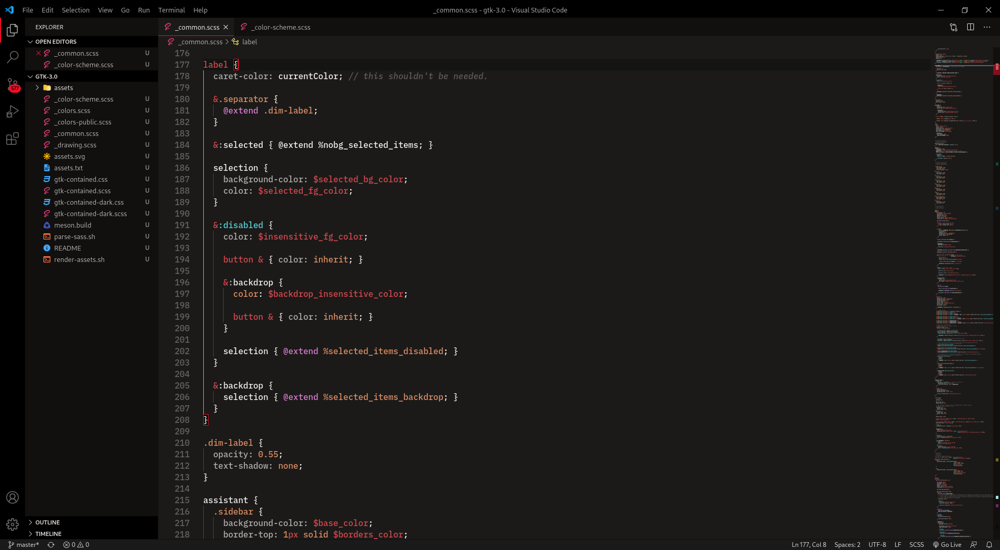
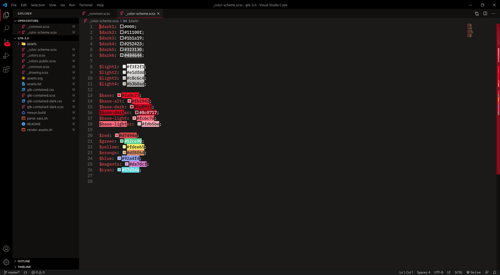

<p align="center">
  
</p>

# [Bloody Pie Theme](https://github.com/wrobeljakub/bloody-pie) for Visual Studio Code
A high-contrast dark theme with bloody red accent.





## How to install

### Manual installation
To install the theme, you need to copy current release to your VS Code extensions folder `.vscode/extensions`. Depending on your platform, it is located in the following folders:

* Windows `%USERPROFILE%\.vscode\extensions`
* macOS `~/.vscode/extensions`
* Linux `~/.vscode/extensions`

## Changelog
[CHANGELOG.MD](CHANGELOG.md)

## [Bugs](https://github.com/wrobeljakub/bloody-pie-vscode/issues)

## Recomended settings
```json
{
    "editor.fontFamily": "'BlexMono Nerd Font'",
	"editor.fontSize": 16,
	"editor.lineHeight": 24,
	"editor.fontWeight": "500",
	"window.titleBarStyle": "custom"
}
```